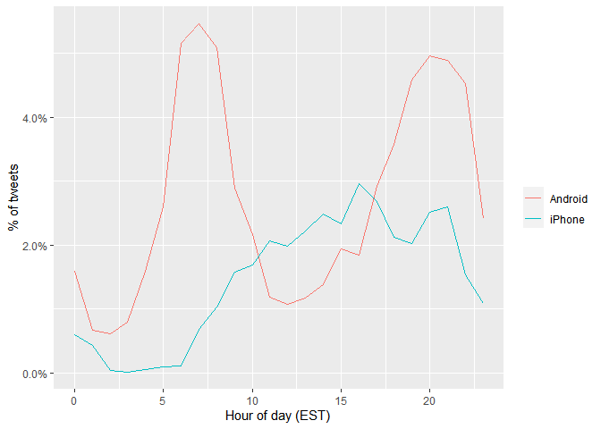
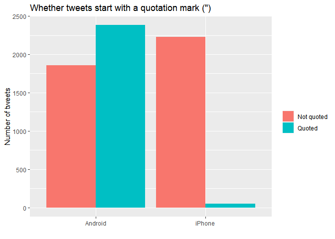
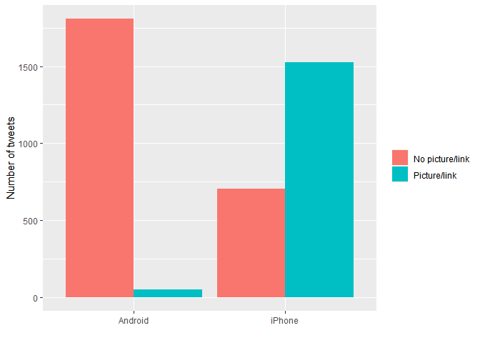
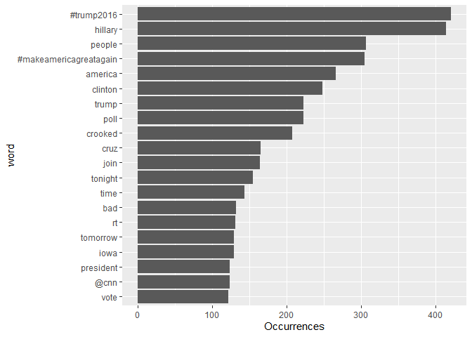
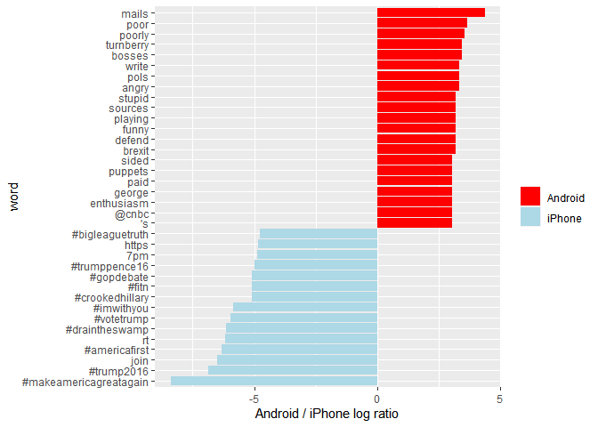
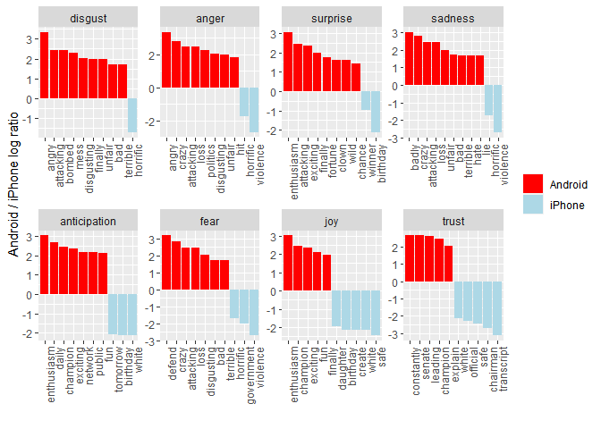

A Text Analysis of Trump’s Tweets
================

## The tweets

Let’s load the content of Donald Trump’s timeline. Our dataset is from
The Trump Twitter Archive by Brendan Brown, which contains all 35,000+
tweets from the @realDonaldTrump Twitter account from 2009 (the year
Trump sent his first tweet) through 2018. We’ll filter it for the
election period only, June 1, 2015 through November 8, 2016.

``` r
# Load the libraries
library(dplyr)
library(readr)
library(tidyr)
library(lubridate)

# Read in the data
tweets <- read_csv("datasets/trump_tweets.csv", guess_max = 36000) %>%
 filter(ymd_hms(created_at)>=ymd("2015-06-01"),ymd_hms(created_at)<=ymd("2016-11-8"))

# Inspect the first six rows
head(tweets)
```

    ## # A tibble: 6 x 8
    ##   source  id_str text  created_at          retweet_count in_reply_to_use~
    ##   <chr>    <dbl> <chr> <dttm>                      <dbl>            <dbl>
    ## 1 Twitt~ 6.83e17 I wo~ 2015-12-31 23:21:49          6776               NA
    ## 2 Twitt~ 6.83e17 Do y~ 2015-12-31 23:11:35          2755               NA
    ## 3 Twitt~ 6.83e17 THAN~ 2015-12-31 18:51:12          2468               NA
    ## 4 Twitt~ 6.83e17 HAPP~ 2015-12-31 16:52:38          2080               NA
    ## 5 Twitt~ 6.83e17 I wo~ 2015-12-31 15:07:18          1875               NA
    ## 6 Twitt~ 6.83e17 #Mak~ 2015-12-31 12:51:35          2285               NA
    ## # ... with 2 more variables: favorite_count <dbl>, is_retweet <lgl>

## Clean those tweets

We’ll clean the data by extracting the source application. We’re only
looking at the iPhone and Android tweets. A much smaller number of
tweets are from the web client or iPad.

Overall, the cleaned data should include 6822 tweets from an iPhone
device and 4681 tweets from an Android device.

``` r
# Count the nubmer of tweets by source
tweets %>% group_by(source)%>%
    count()
```

    ## # A tibble: 14 x 2
    ## # Groups:   source [14]
    ##    source                      n
    ##    <chr>                   <int>
    ##  1 Facebook                    2
    ##  2 Instagram                  47
    ##  3 Media Studio                1
    ##  4 Mobile Web (M5)             1
    ##  5 Periscope                   7
    ##  6 TweetDeck                   2
    ##  7 Twitter Ads                63
    ##  8 Twitter for Android      4240
    ##  9 Twitter for BlackBerry     45
    ## 10 Twitter for iPad           22
    ## 11 Twitter for iPhone       2275
    ## 12 Twitter Mirror for iPad     1
    ## 13 Twitter QandA              10
    ## 14 Twitter Web Client       1301

``` r
# Clean the tweets
cleaned_tweets <- tweets %>%
 select(id_str,source,text,created_at)%>%
  filter(source %in% c("Twitter for iPhone", "Twitter for Android")) %>%
  extract(source, "source", "(\\w+)$")

# Inspect the first six rows
head(tweets)
```

    ## # A tibble: 6 x 8
    ##   source  id_str text  created_at          retweet_count in_reply_to_use~
    ##   <chr>    <dbl> <chr> <dttm>                      <dbl>            <dbl>
    ## 1 Twitt~ 6.83e17 I wo~ 2015-12-31 23:21:49          6776               NA
    ## 2 Twitt~ 6.83e17 Do y~ 2015-12-31 23:11:35          2755               NA
    ## 3 Twitt~ 6.83e17 THAN~ 2015-12-31 18:51:12          2468               NA
    ## 4 Twitt~ 6.83e17 HAPP~ 2015-12-31 16:52:38          2080               NA
    ## 5 Twitt~ 6.83e17 I wo~ 2015-12-31 15:07:18          1875               NA
    ## 6 Twitt~ 6.83e17 #Mak~ 2015-12-31 12:51:35          2285               NA
    ## # ... with 2 more variables: favorite_count <dbl>, is_retweet <lgl>

## Is “time” the giveaway?

Most people are creatures of habit, and we would expect their tweet
times to be a type of ‘signature’. We can certainly spot the difference
here. Most tweets from the Android are in the early morning or later in
the evening, while tweets from the iPhone occur more often in the
afternoon.

``` r
# Load the packages
library(ggplot2)

# Plot the percentage of tweets by hour of the day for each device
cleaned_tweets %>%
  count(source, hour = hour(with_tz(created_at, "EST"))) %>%
  mutate(percent=n/sum(n))%>%
  ggplot(aes(x=hour, y=percent, color = source)) +
  labs(x = "Hour of day (EST)", y = "% of tweets",color="")+
  scale_y_continuous(labels = scales::label_percent()) +
  geom_line()
```

<!-- -->

## The quote tweet is dead

Another place we can spot a difference is in Trump’s anachronistic
behavior of “manually retweeting” people by copy-pasting their tweets,
then surrounding them with quotation marks.

Almost all the quote tweets are posted from the Android.

After this plot, we’ll filter out the quote tweets in the remaining
by-word analyses because they contain text from followers that may not
be representative of Trump’s tweets.

``` r
# Load stringr
library(stringr)

# Plot the number of tweets with and without quotes by device
cleaned_tweets %>%
  count(source,
        quoted = ifelse(str_detect(text, '^"'), "Quoted", "Not quoted")) %>%
  ggplot(aes(x=source, y=n, fill = quoted)) +
  geom_bar(stat = "identity", position = "dodge") +
  labs(x = "", y = "Number of tweets", fill = "") +
  ggtitle('Whether tweets start with a quotation mark (")')
```

<!-- --> \#\# Links
and pictures

Another place we see a difference between the iPhone and Android tweets
is in the sharing of links or pictures. It turns out that tweets from
the iPhone were way more likely to contain either a picture or a link,
while Android (Trump himself) tends to write picture-less tweets.

``` r
# Count the number of tweets with and without picture/links by device
tweet_picture_counts <- cleaned_tweets %>%
  filter(!str_detect(text, '^"')) %>%
  count(source,
        picture = ifelse(str_detect(text, "t.co"),
                         "Picture/link", "No picture/link"))

# Make a bar plot 
ggplot(tweet_picture_counts, aes(x=source, y=n, fill = picture)) +
  geom_bar(stat = "identity", position = "dodge") +
  labs(x = "", y = "Number of tweets", fill = "")
```

<!-- -->

## Comparison of words

Now that we’re sure there is a difference between these two platforms,
what can we say about the difference in the content of the tweets? We’ll
use the tidytext package to tokenize words and remove stopwords.

``` r
# Load the tidytext package
library(tidytext)

# Create a regex pattern
reg <- "([^A-Za-z\\d#@']|'(?![A-Za-z\\d#@]))"

# Unnest the text strings into a data frame of words
tweet_words <- cleaned_tweets %>%
  filter(!str_detect(text, '^"')) %>%
  mutate(text = str_replace_all(text, "https://t.co/[A-Za-z\\d]+|&amp;", "")) %>%
  unnest_tokens(word, text, token = "regex", pattern = reg) %>%
  filter(!word %in% stop_words$word,
         str_detect(word, "[a-z]"))

# Inspect the first six rows of tweet_words
head(tweet_words)
```

    ## # A tibble: 6 x 4
    ##    id_str source  created_at          word          
    ##     <dbl> <chr>   <dttm>              <chr>         
    ## 1 6.05e17 Android 2015-06-01 10:23:13 @foxandfriends
    ## 2 6.05e17 Android 2015-06-01 10:23:13 enjoy         
    ## 3 6.07e17 Android 2015-06-05 03:55:04 worst         
    ## 4 6.07e17 Android 2015-06-05 03:55:04 boring        
    ## 5 6.07e17 Android 2015-06-05 03:55:04 political     
    ## 6 6.07e17 Android 2015-06-05 03:55:04 pundits

## Most common words

What are the most common words @realDonaldTrump tweets? This plot should
look familiar to anyone who has seen the feed.

``` r
# Plot the most common words from @realDonaldTrump tweets
tweet_words %>%
  count(word, sort =TRUE) %>%
  head(20) %>%
  mutate(word = reorder(word, n)) %>%
  ggplot(aes(x=word, y=n)) +
  geom_bar(stat = "identity") +
  ylab("Occurrences") +
  coord_flip()
```

<!-- -->

## Common words: Android vs. iPhone (i)

Now let’s consider which words are most common from the Android relative
to the iPhone, and vice versa. We’ll use the simple measure of log odds
ratio for each word.

We’ll only be looking at words that occur at least five times in both
platforms. There will be some instances with fewer than five uses in
either the Android or the iPhone, but never one with fewer than five
total. If there is one occurrence of a word in the Android, you’ll know
that there are at least four occurrences in the iPhone for the same
word.

``` r
# Create the log odds ratio of each word
android_iphone_ratios <- tweet_words %>%
  count(word, source) %>%
  group_by(word)  %>% 
  filter(sum(n) >= 5)%>%
  spread(source, n, fill = 0) %>%
  ungroup() %>%
  mutate_if(is.numeric, ~((. + 1) / sum(. + 1))) %>%
  mutate(logratio = log2(Android / iPhone)) %>%
  arrange(desc(logratio))

# Inspect the first six rows
head(android_iphone_ratios)
```

    ## # A tibble: 6 x 4
    ##   word       Android    iPhone logratio
    ##   <chr>        <dbl>     <dbl>    <dbl>
    ## 1 mails     0.00167  0.0000798     4.39
    ## 2 poor      0.00102  0.0000798     3.67
    ## 3 poorly    0.000944 0.0000798     3.56
    ## 4 bosses    0.000871 0.0000798     3.45
    ## 5 turnberry 0.000871 0.0000798     3.45
    ## 6 angry     0.000798 0.0000798     3.32

## Common words: Android vs. iPhone (ii)

Now that we’ve calculated the log odds ratio of each word, we’ll plot
the 15 words with the greatest log odds ratio for the Android and the
iPhone.

With the way we’ve set up the log odds ratio, positive values are
assigned to words from the Android, and negative values are assigned to
the iPhone.

``` r
# Plot the log odds ratio for each word by device
android_iphone_ratios %>%
  group_by(logratio > 0) %>%
  top_n(15, abs(logratio)) %>%
  ungroup() %>%
  mutate(word = reorder(word, logratio)) %>%
  ggplot(aes(x=word, y=logratio, fill = logratio < 0)) +
  geom_bar(stat = "identity") +
  coord_flip() +
  ylab("Android / iPhone log ratio") +
  scale_fill_manual(name = "", labels = c("Android", "iPhone"),
                    values = c("red", "lightblue"))
```

<!-- -->

## Adding sentiments

What do we know so far?

  - Most hashtags come from the iPhone. Indeed, almost no tweets from
    Trump’s Android contained hashtags, with some rare exceptions like
    this one. (This is true only because we filtered out the quoted
    “retweets,” as Trump does sometimes quote tweets like this that
    contain hashtags).

  - Words like “join” and times like “7 pm”, came only from the iPhone.
    The iPhone is responsible for event announcements like this one
    (“Join me in Houston, Texas tomorrow night at 7 pm\!”)

  - Emotionally charged words, like “poorly,” “angry,” and “stupid” were
    more common on Android. This supports the original hypothesis that
    this is the “angrier” or more hyperbolic account.

Since we’ve observed a difference in word use between the Android and
iPhone tweets, let’s see if there’s a difference in sentiment. We’ll
work with the NRC Word-Emotion Association lexicon, available from the
tidytext package, which associates words with ten sentiments: positive,
negative, anger, anticipation, disgust, fear, joy, sadness, surprise,
and trust.

``` r
# Create a sentiment data frame from the NRC lexicon
nrc <- get_sentiments(lexicon = "nrc")

# Join the NRC lexicon to log odds ratio data frame
android_iphone_sentiment <- android_iphone_ratios %>%
  inner_join(nrc, by = c("word"="word")) %>%
  filter(!sentiment %in% c("positive", "negative")) %>%
  mutate(sentiment = reorder(sentiment, -logratio),
         word = reorder(word, -logratio)) %>%
  group_by(sentiment) %>%
  top_n(10, abs(logratio)) %>%
  ungroup()

# Inspect the first six rows
head(android_iphone_sentiment)
```

    ## # A tibble: 6 x 5
    ##   word        Android    iPhone logratio sentiment   
    ##   <fct>         <dbl>     <dbl>    <dbl> <fct>       
    ## 1 angry      0.000798 0.0000798     3.32 anger       
    ## 2 angry      0.000798 0.0000798     3.32 disgust     
    ## 3 defend     0.000726 0.0000798     3.18 fear        
    ## 4 enthusiasm 0.000653 0.0000798     3.03 anticipation
    ## 5 enthusiasm 0.000653 0.0000798     3.03 joy         
    ## 6 enthusiasm 0.000653 0.0000798     3.03 surprise

## Android vs. iPhone sentiments

Now we’ll take a look at the sentiments of the common words from both
devices. We’ll see that a lot of words annotated as negative sentiments
(with a few exceptions like “crime” and “terrorist”) are more common in
Trump’s Android tweets than the campaign’s iPhone tweets.

``` r
# Plot the log odds ratio of words by device in groups sentiments
ggplot(android_iphone_sentiment, aes(x=word, y=logratio, fill = logratio < 0)) +
  facet_wrap(~ sentiment, scales = "free", nrow = 2) +
  geom_bar(stat = "identity") +
  theme(axis.text.x = element_text(angle = 90, hjust = 1)) +
  labs(x = "", y = "Android / iPhone log ratio") +
  scale_fill_manual(name = "", labels = c("Android", "iPhone"),
                    values = c("red", "lightblue"))
```

<!-- -->
